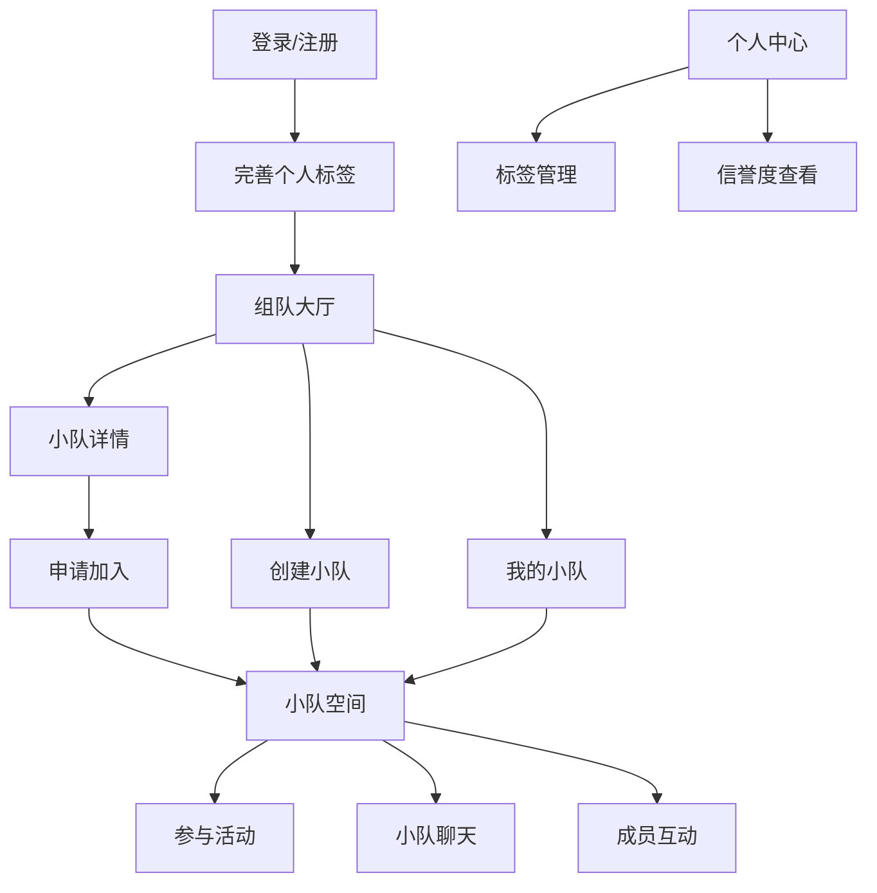

# 兴趣小队社交平台用户界面设计文档

## 1. 产品概述

兴趣小队社交平台是一个专注于兴趣组队和社交互动的在线平台。用户可以根据共同兴趣创建或加入小队，参与游戏、聊天、活动等多种形式的社交互动。平台旨在帮助用户找到志同道合的伙伴，组建稳定的兴趣小组，共同参与各类线上线下的活动和游戏。

核心价值：通过小队机制促进深度社交，让用户在共同兴趣的基础上建立更紧密的联系。

## 2. 核心功能模块

### 2.1 用户角色

| 角色 | 注册方式 | 核心权限 |
|------|----------|----------|
| 普通用户 | 邮箱/手机号注册 | 创建小队、加入小队、参与聊天、发布动态 |
| 小队队长 | 创建小队自动成为队长 | 管理小队设置、审核成员、组织活动、解散小队 |
| 管理员 | 系统分配 | 平台最高权限，负责全站内容审核、用户管理、系统配置、小队管理 |

### 2.2 功能模块

平台主要包含以下核心页面：

1. **组队大厅**：发现和搜索兴趣小队，按标签筛选，查看小队详情
2. **我的小队**：管理已加入的小队，查看小队动态和消息
3. **小队空间**：小队内部页面，包含聊天、活动、成员管理等功能
4. **个人中心**：个人信息管理、兴趣标签设置、信誉度展示
5. **创建小队**：创建新的小队，设置基本信息和规则

### 2.3 页面详情

| 页面名称 | 模块名称 | 功能描述 |
|----------|----------|----------|
| 组队大厅 | 小队推荐 | 展示热门和推荐的小队，支持按兴趣标签筛选 |
| 组队大厅 | 搜索过滤 | 按游戏类型、活动时间、人数等条件搜索小队 |
| 组队大厅 | 小队卡片 | 显示小队名称、成员数、活跃度、主要兴趣标签 |
| 我的小队 | 小队列表 | 展示用户加入的所有小队，显示未读消息数 |
| 我的小队 | 快速入口 | 一键进入最近活跃的小队空间 |
| 小队空间 | 实时聊天 | 支持文字、语音、图片消息，显示在线成员 |
| 小队空间 | 活动日程 | 展示小队计划的游戏时间和活动安排 |
| 小队空间 | 成员列表 | 显示成员头像、等级、在线状态，支持@功能 |
| 小队空间 | 小队相册 | 分享游戏截图、活动照片，支持点赞评论 |
| 个人中心 | 兴趣标签 | 设置个人兴趣标签，用于小队匹配推荐 |
| 个人中心 | 信誉度 | 显示用户组队信誉评分，基于活跃度和评价 |
| 创建小队 | 基本信息 | 设置小队名称、描述、头像、主要兴趣标签 |
| 创建小队 | 加入设置 | 设置加入方式（自由加入/审核加入/邀请制） |

## 3. 核心流程

### 用户主要操作流程：

1. **新用户流程**：注册登录 → 完善兴趣标签 → 浏览组队大厅 → 申请加入小队 → 进入小队空间互动
2. **创建小队流程**：点击创建小队 → 填写小队信息 → 设置加入规则 → 邀请好友或等待申请
3. **日常互动流程**：进入我的小队 → 选择活跃小队 → 参与聊天讨论 → 查看活动安排 → 参与游戏

### 页面导航流程图：

## 4. 用户界面设计

### 4.1 设计风格

- **主色调**：#6c5ce7（紫色）- 代表创造力和社交
- **辅助色**：#a29bfe（浅紫）- 用于背景和渐变
- **强调色**：#00b894（绿色）- 用于成功状态和在线指示
- **警告色**：#fdcb6e（黄色）- 用于通知和提醒
- **按钮风格**：圆角矩形，带有轻微阴影效果
- **字体**：中文使用思源黑体，英文使用Inter，主要字号14-18px
- **布局风格**：卡片式布局，强调群组视觉元素
- **图标风格**：使用圆润的线性图标，强调团队和社区概念

### 4.2 页面设计概述

| 页面名称 | 模块名称 | UI元素 |
|----------|----------|--------|
| 组队大厅 | 小队推荐 | 横向滚动的卡片组，每个卡片显示重叠的成员头像，突出团队感 |
| 组队大厅 | 搜索过滤 | 顶部搜索栏，下方标签云展示热门兴趣，支持多选过滤 |
| 我的小队 | 小队列表 | 网格布局的小队卡片，显示最新聊天预览和未读消息红点 |
| 小队空间 | 聊天区域 | 左侧成员列表显示在线状态，右侧聊天窗口支持富文本消息 |
| 小队空间 | 活动日程 | 时间轴形式展示近期活动，支持一键报名和提醒设置 |
| 个人中心 | 兴趣标签 | 可拖拽的标签云，支持自定义颜色和大小，体现个性化 |
| 个人中心 | 信誉度 | 五星评分配合进度条，显示具体评分维度和改进建议 |

### 4.3 响应式设计

- **桌面优先**：主要面向PC端用户，优化大屏幕体验
- **移动端适配**：支持平板和手机访问，采用自适应布局
- **触摸优化**：按钮和交互元素适配触摸操作，最小点击区域44px

### 4.4 视觉元素指导

- **群组视觉**：使用重叠的圆形头像表示小队成员，营造团队氛围
- **动态效果**：小队卡片hover时显示成员头像动画，增强互动感
- **状态指示**：在线成员头像带绿色边框，活跃小队显示脉冲动画
- **徽章系统**：为不同类型的小队设计专属徽章（游戏、学习、运动等）

## 5. 技术实现

### 5.1 前端技术栈
- **框架**：React 18 + TypeScript
- **状态管理**：Zustand
- **UI组件**：Tailwind CSS + Headless UI
- **实时通信**：Socket.io-client
- **路由**：React Router v6

### 5.2 后端服务
- **认证**：JWT + Refresh Token
- **数据库**：PostgreSQL（用户、小队、消息数据）
- **实时服务**：WebSocket（聊天、在线状态）
- **文件存储**：阿里云OSS（头像、图片、文件）

### 5.3 核心功能实现
- **小队匹配算法**：基于兴趣标签相似度和活跃度推荐
- **实时聊天**：WebSocket实现群聊和私聊功能
- **消息推送**：集成第三方推送服务（极光推送）
- **图片压缩**：前端Canvas压缩，优化加载速度